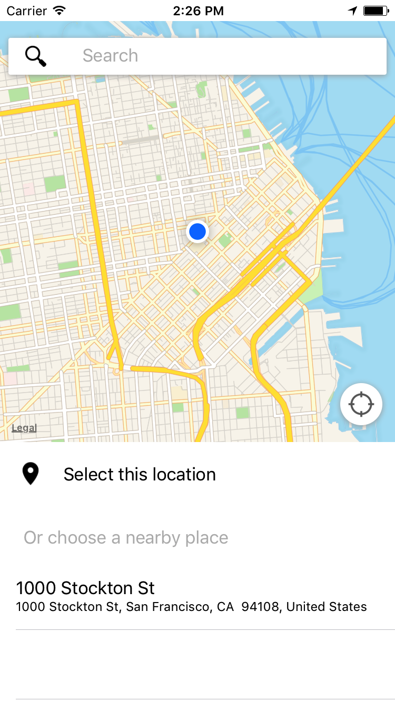
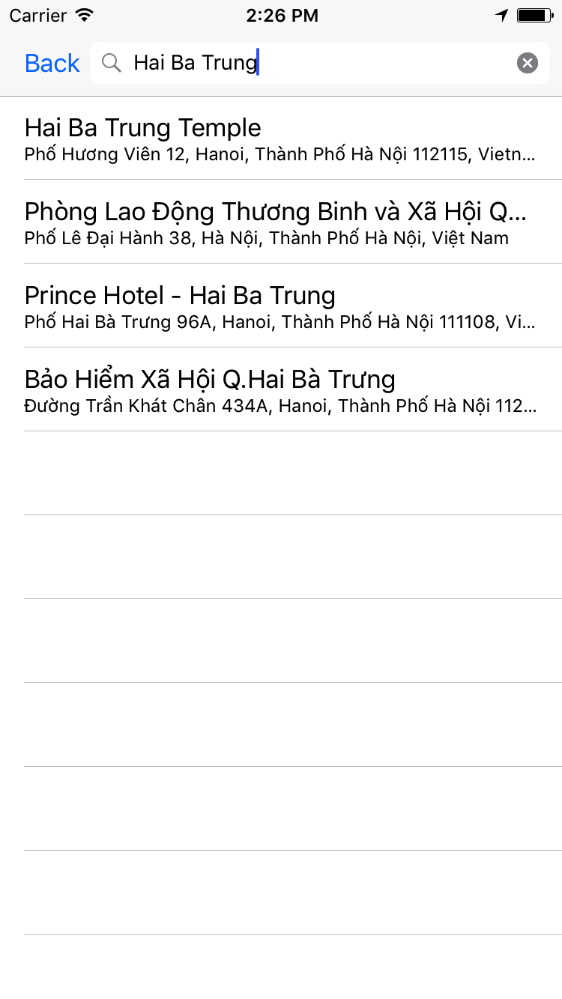
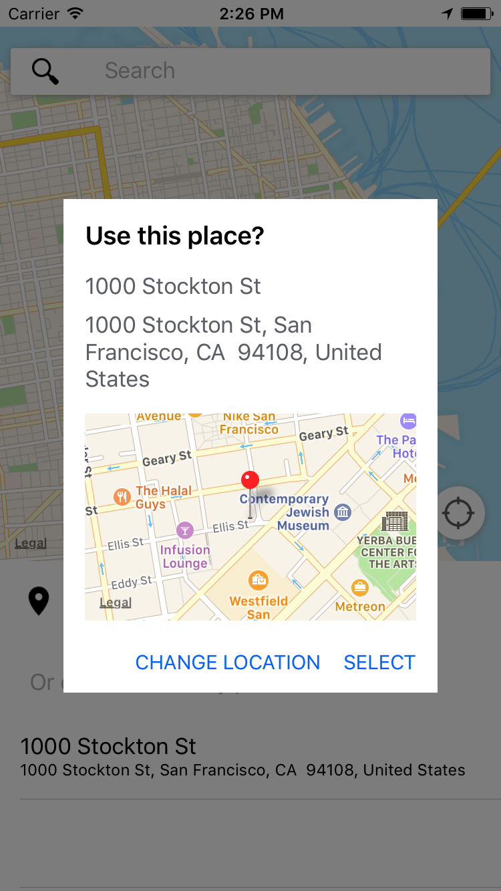

# iOS - MapKit PlacePicker
iOS PlacePicker using entirely MapKit, CoreLocation

|          |             |    |
| ------------- |:-------------:| -----:|
|  | |  |
 

# Installation

CocoaPods
```
target 'MyApp' do
	pod "NXPlacePicker"
end
```

Nuget
```
Install-Package Naxam.iOS.PlacePicker
```

# How to use
```Swift
import UIKit
import AddressBookUI

class ViewController: UIViewController , NXPlacePickerDelegate{

    @IBOutlet weak var btnPickPlace: UIButton!
    @IBOutlet weak var lblSelectedPlace: UILabel!
    
    @IBAction func doPickPlace(_ sender: UIButton) {
        let vc = NXPlacePickerViewController.initWith(self)
        
        self.present(vc, animated: true, completion: nil)
    }
    
    override func viewDidLoad() {
        super.viewDidLoad()
        // Do any additional setup after loading the view, typically from a nib.
        
    }

    override func didReceiveMemoryWarning() {
        super.didReceiveMemoryWarning()
        // Dispose of any resources that can be recreated.
    }

    override func viewDidAppear(_ animated: Bool) {
        super.viewDidAppear(animated)
    }
    
    // NXPlacePickerDelegate
    func placePicker(_ viewController: NXPlacePickerViewController, didSelectPlace place: MKPlacemark) {
        viewController.dismiss(animated: true, completion: nil)
        lblSelectedPlace.text = ABCreateStringWithAddressDictionary(place.addressDictionary!, false)
        print(place)
    }
    
}
```

```C#
using System;
using System.Collections.Generic;
using Foundation;
using MapKit;
using Naxam.iOS.PlacePicker;
using UIKit;

namespace DemoBindingNXPlacePicker
{
	public partial class ViewController : UIViewController, INXPlacePickerDelegate
	{
		protected ViewController(IntPtr handle) : base(handle)
		{
			// Note: this .ctor should not contain any initialization logic.
		}

		public override void ViewDidLoad()
		{
			base.ViewDidLoad();
			// Perform any additional setup after loading the view, typically from a nib.

            btnSelectPlace.TouchUpInside += delegate {
				NXPlacePickerViewController vc = NXPlacePickerViewController.InitWithDelegate(this);
				this.PresentViewController(vc, true, null);
            };
		}

		public override void ViewDidAppear(bool animated)
		{
			base.ViewDidAppear(animated);
		}

		public override void DidReceiveMemoryWarning()
		{
			base.DidReceiveMemoryWarning();
			// Release any cached data, images, etc that aren't in use.
		}

		// INXPlacePickerDelegate
		public void DidSelectPlace(NXPlacePickerViewController viewController, MKPlacemark place)
		{
            viewController.DismissViewController(true, null);
            var addressLines = place.AddressDictionary["FormattedAddressLines"] as NSArray;
            lblSelectedPlace.Text = string.Join(", ", (IEnumerable<NSString>)NSArray.FromArray<NSString>(addressLines));
			//throw new NotImplementedException();
		}
	}
}
```
